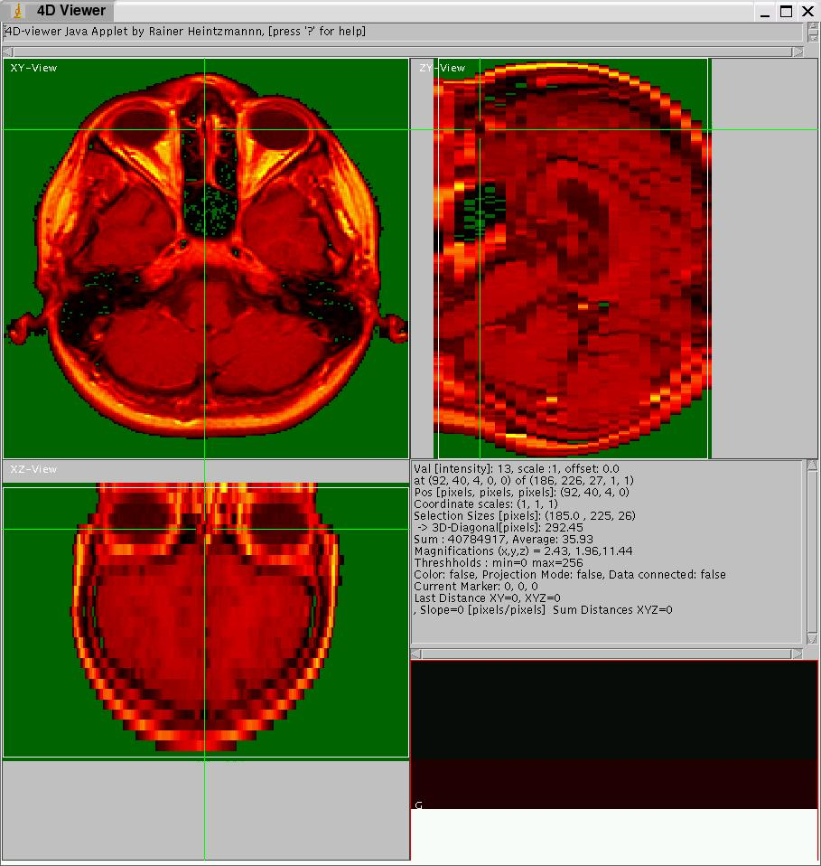
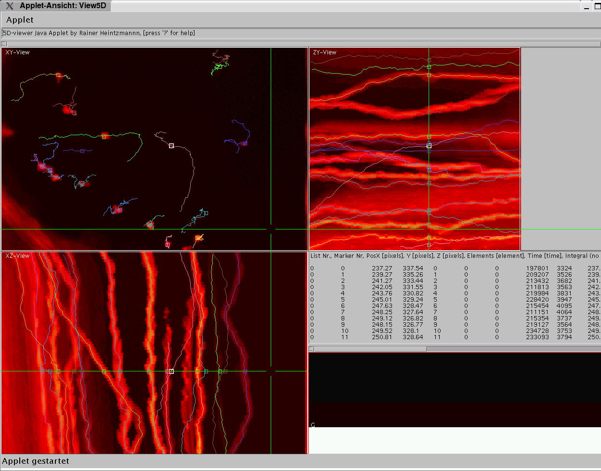

 ---
# Feel free to add content and custom Front Matter to this file.
# To modify the layout, see https://jekyllrb.com/docs/themes/#overriding-theme-defaults

layout: splash
title: Bio-Nanoimaging Group
header:
  overlay_image: assets/images/banner.jpg
  overlay_filter: 0.4 # same as adding an opacity
---

Example Screenshots View5D
==========================

The applet itself can be [accessed](#Testing) at the end of this document.  
Below you can see a screenshot (MRI Stack example dataset from ImageJ) of View5D, currently displaying three orthogonal sections, each extracted from the appropriate lines indicated by the green crosshairs. Currently a non-linear colormap (red glow) is chosen and the overflow/underflow-toggle is active as can be seen by the green background. Clicking on the image displays it in original size, which helps reading the displayed information (text on the right side).

* * *

  

* * *

The next example shows a series of 2D microscope images (which actually are maximum projections of confocal data) stacked along the 3rd dimension. The lower left part is in projection mode displaying a sum-projection of only the ROI selected in the XY-view. Furthermore markers are set in 3D and the line conneting them is displayed as a projection. The distance as well as the slope (in this case speed of movement) is given.

* * *

* * *

A tracking application using View5D is shown below. The dataset was provided by Michael Redd, University College London, UK. Two of the automatically traced cell positions needed to be refined by hand in a few time steps. For better visualization the YZ- and XZ-views have been switched to the projection mode. Note that some cells are to dim to be seen at the viewer setting at which this picture was taken.

* * *

  

* * *

Below a 3-color image loaded from ImageJ is displayed. A region of interest was selected and the corresponding 2D (red, blue) histogram of it and another region situated in the nose of the mandrill is displayed in a seperate viewer below.

* * *

  

* * *

A region of interest selected in the histogram (as displayed above) was then applied to generate a gate (displayed in green) in the original data (red channel displayed as grayscale):  

* * *

  

* * *

The View5D Applet can be accessed in the examples below
-------------------------------------------------------

On some systems (e.g. MacOS 9) there are known problems running the applets, which is due to an old Java runtime engine (preferably use a recent one from Sun Microsystems) or insufficient memory available to the Java runtime engine (This can eventually be configured somewhere!?).  
  

Axialtomographic reconstruction of a spore (3D, 2 color, R. Heintzmann, Univ. of Heidelberg):  [sporebyte.html](sporebyte.html)

  
7-color FISH (Dataset by Christine Fauth, LMU Muenchen): [small.html](small.html)

  
  
  
  
[Back to the View5D homepage](../View5D.html)  
For hints and suggestions, contact the author under heintzmann at gmail dot com