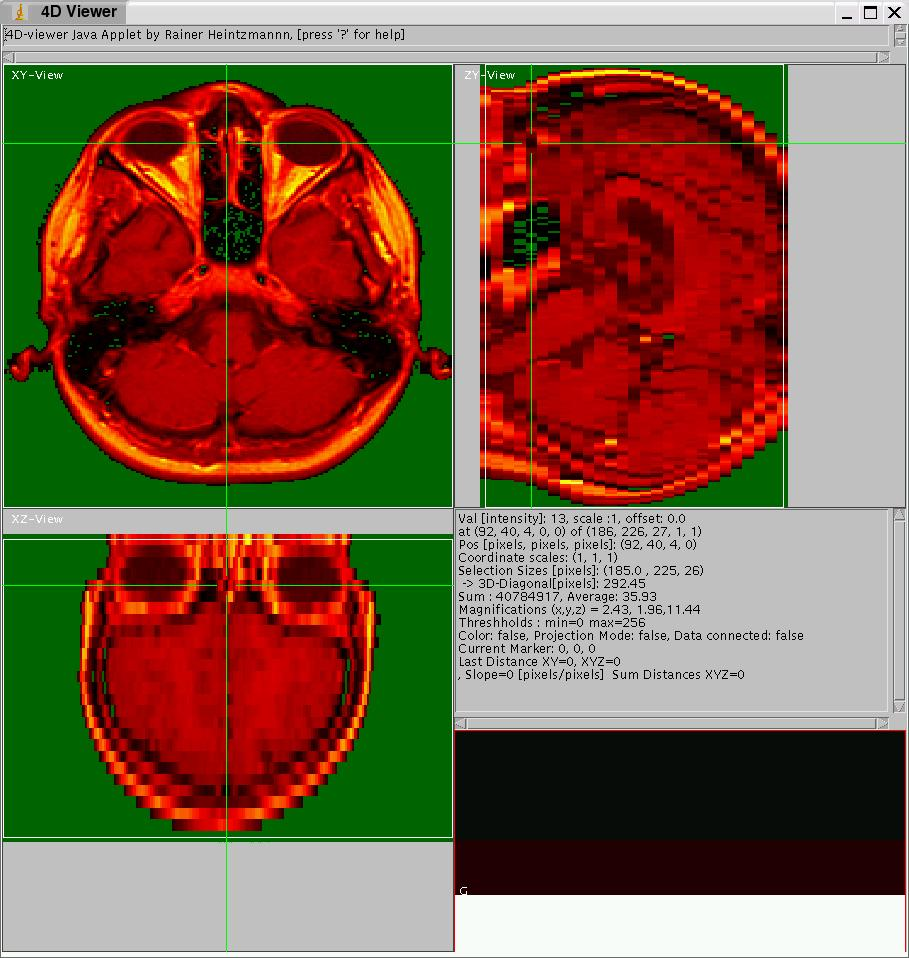

---
# Feel free to add content and custom Front Matter to this file.
# To modify the layout, see https://jekyllrb.com/docs/themes/#overriding-theme-defaults

layout: splash
title: Bio-Nanoimaging Group
header:
  overlay_image: assets/images/banner.jpg
  overlay_filter: 0.4 # same as adding an opacity
---

View5D - an interactive image viewer
=====================

ImageJ, Matlab and Julia plugin and Java applet ([current Version](https://github.com/bionanoimaging/View5D) )  

--------------------------------------------------------------------------------------------------------------

### Rainer Heintzmann,   
[Leibniz Institute of Photonic Technology](https://www.leibniz-ipht.de/en/departments/microscopy/) , Jena, Germany,  
[Institute of Physical Chemistry, Friedrich-Schiller Universty, Jena](https://www.ipc.uni-jena.de/en/research-groups/heintzmann-group) , Jena, Germany and  
[Abbe Center of Photonics, Friedrich-Schiller Universty, Jena](https://www.acp.uni-jena.de/) , Jena, Germany  
  
(heintzmann at gmail dot com)

The program View5D interactively displays of up to 5 dimensional volumetric datasets.

Multi-dimensional data frequently arises in confocal microscopy and medical imaging applications. The applet can be tested by clicking the links below, however a Java runtime environment (preferably from Sun Microsystems) must have been installed and Java activated in the preferences of your browser!

Here are some [example screen shots](examples/index.html). 
The applet version can be [tested](examples/index.html#Testing) and the [interactive online tutorials](View5DOnlineTutorials.html) are not working properly any more, since current browsers do not support applets.
There is also a [reference of all commands](View5DCommandReference.html) and a [cheat-sheet](CheatSheet.pdf). A YouTube playlist with a few explanatory videos is found [here](https://www.youtube.com/watch?v=fqa82MmJlAA&list=PL3LueK3ij6Wm2VjaaibNdulxFvA6VhVRv).

Most of its commands are accessible via context menus (right mouse button in Windows) and each command has a hot-key as stated in the menu (be careful hitting keys!). The mouse wheel allows to zoom and shift-mouse-wheel modifies the gamma-curve of this color channel (shift-click of the mouse wheel resets gamma to one).
Note that divergin colormaps have appropriately adjusted gamma and log behaviour to keept the zero at the center of the colormap.

### Main features of View5D are: 
*   Simultaneous display of 3 orthogonal slices: axial (XY), sigittal (YZ) and frontal (XZ). Continuous update of the slicing positions by mouse clicks /drags.
*   Semiautomatic tracking of maxima or minima in up to 5 dimensions. Interactive adjustment and correction of tracks. Alignment of data to tracks (!). Support of lineage naming.
*   Scattergrams from multiple colors in up to 3 dimensions and interactive switching between ROIs in images and ROIs in the multidimensional histogram.
*   Toggles between single color and multicolor mode. An arbitrary number of color channels can be overlaid. A "multiplicative" mode allows the overlay of intensity and color-coding (e.g. fluorescence lifetime) images.  
    
*   Support of time series of data of equal size
*   Selection of regions of interest (ROIs) in 3D for further processing. The shape can either be rectangular or the inner region of connected line segments (poly-line ROI).
*   Toggle between sliced views and projections (maximum intensity projection or average intensity projection) of the full field or of ROIs.
*   The user has access to the information about the real-world positions as well as the data content (such as absolute intensities or Houndsfield units for MRI data).
*   Setting marker positions in 3D and measuring distances between them.
*   Toggles between slice / projection and orthogonal line-scan plots.
*   Support for  spectral information in every voxel (any number of color channels).
*   Simultaneous display of multiple spectra from different positions (by using the position markers).
*   Up to 3 dimensional histograms generated from a number of previously selected datasets. Overlay of multiple histograms.
*   Selecting ROIs in the histogram and generation of a binary image labeling the voxels corresponding to the ROIs selected in the multi-dimensional histogram.

Tutorials
---------

[Online-Tutorials](View5DOnlineTutorials.html) are also available. However, they do not run any longer in modern browsers, since the Applet tag is not any longer supported.

How to obtain
-------------

Download [the current development and release version](https://github.com/bionanoimaging/View5D) as a zip-file with all the necessary classes and an example html-file in it. Just place it into your folder visible on the net together with a raw-data file (stacked X, Y, Z, Elements), edit the html file to refer to the correct raw data filename and to the correct dimensional sizes. The included jar file works both for the applet version and the ImageJ version.  

The ImageJ plugin can be used as a plugin with the documentation and examples included or you can download only the plugin. To install it in ImageJ, create a folder "View5D" in the plugin directory of ImageJ and unpack the zip file into this "View5D" folder or place the jar file directly into the ImageJ plugin folder.

If you want to modify the source to adapt it to your special needs you can do so under the terms of the GPL2 license. The [source](https://github.com/bionanoimaging/View5D) code is also available, currently as a single java file and supporting files (mostly for developing in Linux). Please feel free to send useful improvements back to me.

ImageJ plugin, Java applet and MATLAB plugin  

-----------------------------------------------

The View5D Java program can be compiled as Java Applet or as a plugin to ImageJ, MATLAB and Julia. Its functionality remains identical; only the way its loads and saves data differs between applet and plugin. To optain information on the specific details, click [Applet](View5DasApplet.html), [ImageJ plugin](View5DasImageJ.html), or as applet within [MATLAB](View5DasMatlab.html). You can also start View5D from Julia offering many ways to interact with the Viewer directly from Julia. For more details see [View5D in Jullia](https://github.com/RainerHeintzmann/View5D.jl). 
  

Almost all commands in View5D can be addressed via the keyboard (be careful when you type, as every letter has an action!) or the menu (right click in one of the data-display windows) and selection from the popup menu.  

The most recent version of View5D and documentation can been found on the web page [http://www.nanoimaging.de/View5D/](http://www.nanoimaging.de/View5D/)  
(this is probably exactly the document you are just reading).  

Time-series
-----------

Display of time-series data is supported. When reading in the data from ImageJ the user can specify the number of timepoints in the dataset. The order of the data needs to be X, Y, Z, Time, Elements except for RGB data, where multiple elements are stored in the same integer. Depending on the application it may be useful to reorder the data before reading it in. Exchanging dimensions can be very useful (e.g. displaying time along the depth direction) since the projections along the time can be made and velocities estimated. However, there is currently no support of dimension exchange within the program, and the reordering has to be done prior to loading the data.

*   "shift next page" and "shift prev page" or "," and "." will step through the timesteps of the data. This also works when in the projection mode. The color settings as well as ROIs are kept the same and cannot be set individually for different times.

Single Particle Tracking
------------------------

View5D can perform a guided particle tracking analysis (see also the [interactive online tutorial](View5DOnlineTutorials.html) on particle tracking). If the data is a series of 2D images, it is most useful to stack them along z-direction, for 3D+time data the stacking along time direction should be used. The direction along which to track can be selected via the Popup-menu in the user interface accessible via "n". The "Use automatic maximum finding" option and the "subpixel position by Center of Mass" option (in the menu accessed by "n") should be activated. For 2D+time data the "Z Neighbours" search width should be set to zero. In the fist time-point where a particle to track is visible, it should be marked using "m". By pressing "W", the particle is tracked thoughout the stack starting from the currently active marker. The tracking is performed, looking the maximum (with iterative refinements and Center of Mass determination) in the next slice in the region determined by the "X Neighbours", "Y Neighbours" setting, starting at the positions of the previous slice. Once a trace has been generated, it can be corrected by dragging the appropriate wrongly assigned marker to the correct spot and pressing "W" to refine all successive time-points. It is useful to deactivate "Show all slices", in which case the active marker corresponds to the displayed slice. The track can conveniently be checked by advancing along its direction with pressing "0" and "9".  
The next particle-track can be started by pressing "k" near its position in the slice, where it is first visible. See section Markers for details of navigating in marker lists.  
When tracking multiple cells or intracellular components it is useful to align the visualisation to a neighbouring track "|". The saved track data will still correspond to the raw data, but the tracking algorithms search in the aligned frames and find corresponding particles much easier.  
When cells devide it is useful to keep track of the cell lineage. A division at the end of a track can be initiated by pressing "\\". This will generate two markers on which the track then can be continued.  
If a particle is bleached, the particle tracker will still try to continue. For convinience the remaining part of a track can be deleted by pressing "Q". Once a particle track is determined, the estimated particle can be subtracted from the data by pressing "#". The subtraction is based on a Gaussian of selected width (see menu under "n") and the momentary integral intensity calculated for the position in the particle track.  
Finally the output of all partcle traces and intensities can be generated with "m" pressed in the lower right element (or spectral) display window. The text output can then be cut-and-pasted to any editor.  
The "repulsion" toggle in the menu accesible via "n" switches a Gaussian based intensity-subtraction during the determination of marker position on and off. Note, that this feature does not permanently subtract information from the intensity. With the "repulsion" on, the marker finding can be very slow, since the influence of all other markers has to be tested.  
By pressing "q" multiple times in the element window, it is possible to show the different intensity information in the marker lists as plots. The X-direction of the plot is determined by the "Track direction" toggle in the marker-menu ("n"). This feature is useful to e.g. plot the intensity of vesicles during their movement through a cell.  
  

ROIs
----

For many applications it is useful to define regions of interest (ROIs). These define the 3-dimensional data volume on which a number of processing algorithms act. Since it is difficult to define 3D ROIs, the following approach was selected: A voxel belongs to the 3D ROI, if it is positioned inside all three 2D-ROIs given in the orthogonal slices or projections. This is useful for many application but does not allow to define all arbitrary shapes in 3D. In a future version this will be improved by allowing multiple 3D ROIs to be active at the same time.

*   Dragging the mouse with the "shift" key pressed defines a rectangular ROI. Each time this action is performed the old 2D-ROI (initially full field) in only this view is discarded and a new 2D-ROI is generated (indicated by the white rectangle).
*   By a mouse click (without drag!) and the "shift" key pressed in the rectangular ROI mode, the ROI in this view is reset to the maximum possible sizes. This will affect parts of the ROI sizes in the other views but not the ROI size orthogonal to the view where the click was performed.
*   The ROIs can be moved by Ctrl-clicking them and dragging the grey ROI accross the screen. The "Ctrl" key has also to be pressed, when the mouse is released; otherwise the movement is discarded.  
    
*   "S" toggles out and into the rectangular ROI mode. The poly-line ROI mode reached by “S” allows 2D-ROIs of arbitrary shape defined by the interior of a series of line segments.
*   Shift click with the mouse in the poly-line ROI mode starts a series of line segments (deleting the old ROI), the corners of which given by ordinary mouse clicks (no shift is needed). A double click ends the series and closes the ROI.
*   "Y" pressed in a viewer window will generate a new dataset with the ROI extracted. If the viewer is currently in the projection mode, the data will be extracted, otherwise only a threshold image with zero outside the 3D ROI and one inside will be generated. Note also that the effect of marking (see "u") and activating (see "U") any channel for thresholding will be included in the generated image.

Projections and Processing
--------------------------

For the projections as described below, the data values including the effect of the threshold and the logarithmic mode are used. The colormap, however, will not influence the computation of the maximum or average but only have its effect on the display of the result.

*   "p" performs a maximum intensity projection along the direction orthogonal to this view. Only pixels lying inside the 3D ROI are considered, so the ROIs defined in the orthogonal views are of major importance for the result.
*   "P" projects the 3D ROI (or full data) by computing the average of the valid pixels in the orthogonal direction. As opposed to computing the sum, this way the size of the ROI in the orthogonal direction does not bias the result.
*   if in one of the projection modes, the line-plots (as reached by "q") will display appropriate maximum or average values of the appropriate ROI-regions instead.
*   "f" clones the active element and upcasts it to float. At the same time the value scaling and offset are set to 1.0 and zero respectively. The cloned element is especially useful for mathematical calculations (see below). The thresholds will have no influence on cloning an element with "f".
*   "F" clones the active element into a 16-bit integer element. Here the currently set thresholds will be accounted for, normalizing the data between 0 and 65535. The logarithmic mode or the currently set colormap have no influence.  
    
*   "+","-", "\*" and "/" will perform the appropriate mathematical operations on the currently active element and the element marked as gate (see "u"). Since the operations are performed in the same datatype as the active element, the result most times not what you need. Therefore be sure to upcast the datatype to float (see "f" above) before performing any computations.
*   "\_" is a useful tool to adjust the backround level of  an image to zero. The offset will be adjusted such, that the mean of the actual ROI in the current element will be zero.  
    

Histograms
----------

View5D can generate histograms by combining the information from up to 3 elements.

*   "x" marks the active element as histogram X-axis. If the element is already marked, the mark will toggle off.
*   "y" registers the data of this element for the y-axis of a two-dimensional histogram. Toggles as explained above.
*   "z" registers this element as defining the z-axis of a 3-dimensional histogram. Toggles as explained for “x”.
*   "h" generates the multi-dimensional histogram.

Another viewer will pop up containing the histogram. The axes will be calibrated in corresponding value-units. By default the histogram view starts in a logarithmic display mode using a non-linear colormap. The current settings of the threshold lower and upper limit (see "1"-"4") in each participating element will be used to define the limiting bins of the histogram.  
If  "h" is pressed a second time in the original window (for example after having selected a different 3D-ROI) a further element in the histogram will be generated (over- and underflow voxels will go to the highest/lowest bin). The histogram view automatically toggles to multicolor display. The full functionality (e.g. projections), line-scans, ... is available in the histogram view.  
Pressing "h" inside the histogram window itself will generate a new element in the original data display window. This element will mark the position of voxels whose histogrammed elements (as currently defined by the histo-X, histo-Y and histo-Z elements) lie within the currently defined ROIs in the histogram view.  

Bug reports
-----------

If you find any bugs, please send them to me under heintzmannd at gmail dot com stating the system you were using and the java version. Please put "view5d bug" in the subject line.

History of View5D
-----------------

View5D started under the name "View3D" during my PhD time in Heidelberg in the group of Prof. Dr. Christoph Cremer. It was later further developed in the department of molecular biology, director Dr. Thomas Jovin, at the Max Planck Institute for Biophysical Chemistry in Goettingen. There is was tested and used for several sets of biological imaging data (mostly CLSM). The latest additions are from my time at King's College London. The matlab and DIPImage compatibility issues were adressed together with Dr. Bernd Rieger and Dr. Keith Lidke.

Recent changes:
---------------

*   The first version (starting with View3D) was written about 1997.  
    
*   V 0.9997:  ROIs can now be dragged by Ctrl-clicking
*   V 0.9998:  Mouse operation was changed. Left clicks change slicing position, middle-mouse-button drags (or space-click or alt-clicks) allow to drag the displayed area.
*   V 1.0.0beta: Intensity scaling made more transparent to the user.
*   V 1.0.01 beta: Added some tutorial material
*   V 1.0.01 beta:  ImageJ-version of View5D: Plots can now be saved as ImageJ plots ('X' when in plot mode). All axes scalings should work correctly.  
    
*   V 1.0.02 beta: Axes are now named. As are the values. This is useful for ratio or lifetime display.
*   V 1.0.03 beta: Fixed units and scaling in export and import to and from ImageJ. Also Value Offset and Scaling is now supported.
*   V 1.0.04 beta: Colormaps can now be imported from ImageJ, when present in the image to import.  
    
*   V 1.0.04 beta: Offset can be automatically callibrated via "\_".
*   V 1.0.04 beta: Support of ratioing "/".  
    
*   V 1.0.05 beta: Number of active list is shown in coordinate textwindow "/".  
    
*   V 1.0.06 beta: Fixes bug in Colormap import "/".
*   V 1.0.07 beta: Introduced "Double" and "Complex" datatypes. Selection of datatype changed (backwards compatible) by introducing the addtional tag "dtype" with possible values: "Byte","Short","Long","Integer","Float","Double" and "Complex"
*   V 1.0.08 beta: Bug fixes, Added Matlab support for complex datatype
*   V 1.0.09 beta: fixed Menu on Macintosh to be always a popup menu. Partial fix of Macintosh text-scrolling problem.
*   V 1.0.10 beta: fixes of bugs induced in V 1.0.09 beta (especially visible in Matlab)
*   V 1.0.11 beta: Added support of a Minimum mode during tracking. Bugfix for loading 4 or 5D data in Matlab, double format.
*   V 1.0.12 beta: Bug fix concering the time-slider when spawning the viewer or from MatLab, view5d.m also fixed
*   V 1.0.13 beta: Added support for unsigned types by converting to signed.  
    
*   V 1.0.14 beta: Bugfixes: Processing and casting of time-dependent data. Scaling menu was split (context) into Axes and Value scalings. Min-Max numerical entries added to value menu.
*   V 1.0.15 beta: Displayed text is now configurable (right click on text). Markers have a binary state ("tagging"), which can be changed by clicking or pressing "&" for the active marker or clicking on them when activatable. Bugfixes regarding the display of menus.  
    
*   V 1.0.16 beta: Bugfixes with loading of markers.
*   V 1.0.17 beta: Introduction of a new "Cyclic" colourmap for better display of lifetime and ratio images.
*   V 1.0.18 beta: Added "Annotate" feature for marker lists to show the list number in the image.
*   V 1.0.19 beta: Changed the initial word in the questions at startup to allow remote control from ImageJ
*   V 1.1.01: first release vesion. Color tables work OK now in the projection modes. Compatibility with Image5D achieved. GPL 2 added. Read sizes now directly from the "Properties" section in ImageJ
*   V 1.1.02: A size menu was reintroduced and order of dimension import can be selected.
*   V 1.2.00: Faster display and loading of data at the expense of only showing ROI statistics when a projection was done. Support of lineage naming in tracking. Automatic file number naming of track files. Alignment of Data to tracks "|". Hand adjustment of timepoints or color channels (shift-cursor keys). 
*   V 1.2.01: Alignment over track histories. Bug fix with reading RGB stacks. 
*   V1.2.02: Menu for each track, allowing for splitting and merging and setting colors. Bug fix with alignment.
*   V 1.2.03: Added option to scale the data according to the physical voxelsizes when Importing from ImageJ (Image->Properties). 
*   V 1.2.04: Bug fixes. Now fully supported short datatype. New feature to add new elements from Matlab by using the view5dAddElement(mydata) script or the java function AddElement. These elements can be of different datatype. 
*   V 1.2.6: Split the source into one file per class. This enabled the source being compiled into one jar file independent of the viewer. From now on there is only one distribution for ImageJ plugin and Applet. Fixed a bug for displaying the help information "?" in the main window.      
*   V 1.2.7: Bug fix (displaying the histogram and version number). 
*   V 1.2.8: Bug fix (applet version was not running due to missing public declaration). 
*   V 1.2.9: Bug fix (mulit line text labels did not display correctly). 
*   V 1.2.10: added scripting function ProcessKeyMainWindow and ProcessKeyElementWindow.
*   V 1.2.11: Recompiled version for backward compatibility java target 1.4, source 1.2. Fixed display bug with Polyline ROIs and initialisation in ImageJ. Introduced Gamma exponent into lookup table. 
*   V 1.2.12: Added support for 2D and 3D mean square deviation (MSD) calculation. 
*   V 1.2.13: Introduced view5d as package. This avoids name clashes with other programs. 
*   V 1.2.14: Bug fixes with applet version, loading of marker files from the web. 
*   V 1.2.15: Installed plugin.config file required for proper registration of classes in the plugin menu in some systems. 
*   V 1.2.16: Updated version of the matlab view5d.m file. Fixed problem that previous source files were not archived and not copied.  
*   V Newer Versions: The sources and distributions are now managed via GitHUb. Here you can obtain the [current development version](https://github.com/bionanoimaging/View5D) and the [current release](https://github.com/bionanoimaging/View5D/releases)  
    

Future goals
------------

*   Enable multiple ROIs
*   ROI mode for each slice
*   Dragging the dividing lines inside the viewer

  
  

* * *

[Back to the View5D homepage](View5D.html)  
For hints and suggestions, contact the author under heintzmann at gmail dot com

