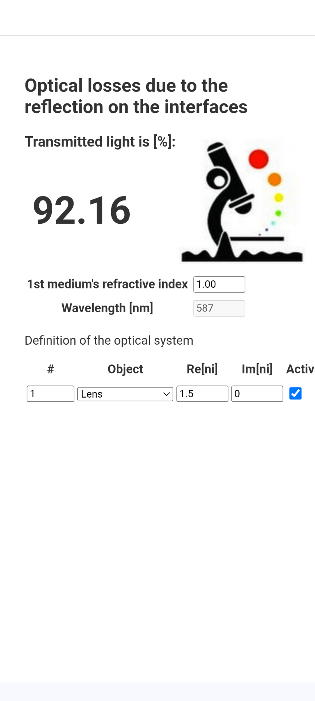

---
# Feel free to add content and custom Front Matter to this file.
# To modify the layout, see https://jekyllrb.com/docs/themes/#overriding-theme-defaults

layout: splash
title: Bio-Nanoimaging Group
header:
  overlay_image: assets/images/banner.jpg
  overlay_filter: 0.4 # same as adding an opacity
---

# Tools for optical laboratory

This page contains list (with a links) of different software and hardware tools, which are useful in everyday life of a researcher in an optical laboratory. These tools were continuously developed in our group and can be freely used by whoever find them useful.

There are different categories of the tools. Some of them are pure software based apps, which helps to estimate parameters of experimental setups or to educate the alignment of optical components. Other tools require either some low-cost commercial hardware or tools, which has to be constructed upon a described instructions.

### Mobile Apps
These apps are compact webpages, which can be simple installed on a phone and then used offline (that is often case for optical labs in the cellar). These apps should help you to estimate parameters for data acquisition, signal intensity, etc.
Apps are based on [Progressive Web App](https://en.wikipedia.org/wiki/Progressive_web_app) technology. The app itself is web page, which can be viewed in any web browser. For the offline use the app has to be installed through majority of browsers ([How to install PWA](https://developer.mozilla.org/en-US/docs/Web/Progressive_web_apps/Installing")).

#### 1. Nyquist sampling calculator 

  link to the [webpage](https://rainerheintzmann.github.io/IPHTNyquist/) 

#### 2. Optical losses by reflection on the interfaces

  link to the [webpage](https://ondrejstranik.github.io/pwa-optics/) 

### Widgets

#### 1. Smart Inventory

Intelligent tools to easy identify small optical components.

#### 2. CageCam

Small cameras, which can be clicked on the Thorlabs cage system and the video images are streamed wireless on the mobile phones/computers. It is useful for an aliment. Also small light sources are available.    

### Education Software

#### 1. Align it
  Game teaching how to proper align an optical system.

